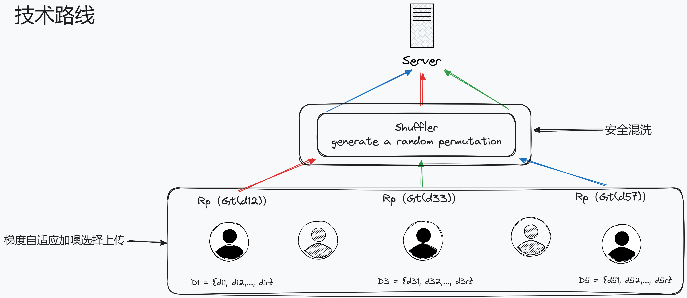
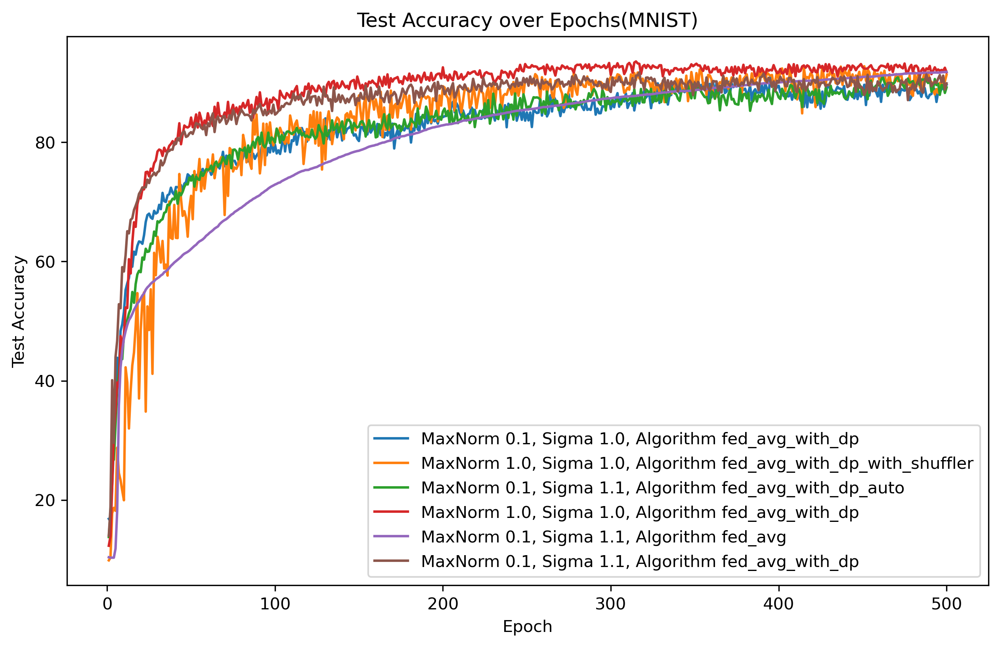
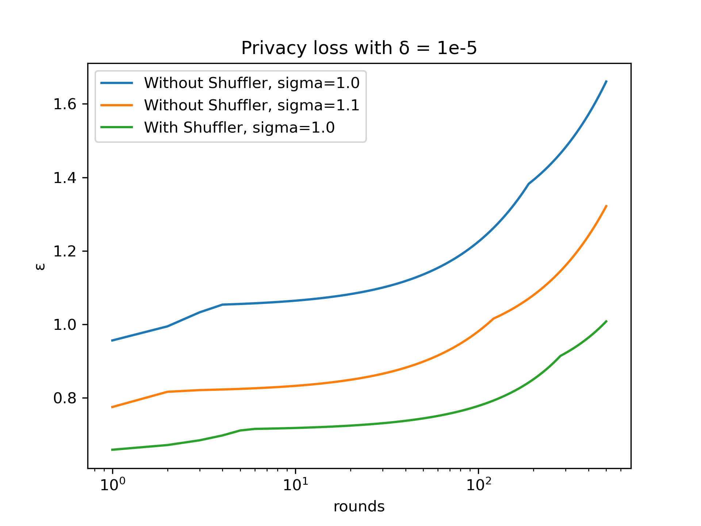

# 💠 Differential Privacy and Shuffler in Federated Learning System

This graduate project aims to enhance the privacy protection capabilities of federated learning systems by integrating Differential Privacy and the Shuffler mechanism, designed for distributed machine learning scenarios with stringent privacy requirements.

## 🌓 Motivation and Background

Protecting individual privacy in the era of ubiquitous data is a significant challenge. Federated learning offers a way to conduct machine learning tasks without sharing raw data among participants but still faces potential privacy leakage risks. This project introduces Differential Privacy and the Shuffler mechanism to minimize these risks and enhance the system's overall privacy protection.

## 💅 Folder Directory Structure

The folder directory structure is organized as follows:

```bash
.
├── algorithms  ## Houses the implementation of the Differential Privacy Stochastic Gradient Descent (DPSGD) algorithm and the training script utilizing DPSGD.
│   ├── DPSGD.py
│   └── train_with_DPSGD.py
├── data        ## Contains datasets (e.g., CIFAR-10, Fashion MNIST, MNIST) and utility scripts for data handling and processing.
│   ├── cifar-10-batches-py
│   ├── FashionMNIST
│   ├── MNIST
│   └── utils
│       ├── custom_tensor_dataset.py
│       ├── dirichlet_nonIID_data.py
│       ├── get_data.py
│       └── sampling.py
├── FL          ## Dedicated to Federated Learning (FL) scripts, including various federated averaging implementations with differential privacy integrated.
│   ├── fed_avg
│   │   ├── fed_avg.py
│   │   ├── fed_avg_with_dp_auto.py
│   │   ├── fed_avg_with_dp_perlayer.py
│   │   ├── fed_avg_with_dp.py
│   │   └── fed_avg_with_dp_with_shuffler.py
│   └── utils
│       ├── create_client.py
│       ├── local_train.py
│       ├── log_helper.py
│       ├── train_helper.py
│       └── update_model.py
├── imgs
│   └── architecture.png
├── log  ## Log the test_loss and test_accuracy for models of different fed algorithms.
├── models      ## Comprises model definitions for different datasets used in the project.
│   ├── CIFAR10.py
│   ├── FMNIST.py
│   ├── get_model.py
│   └── MNIST.py
├── privacy_analysis    ## Focused on the privacy analysis of the implemented algorithms, with scripts to compute and visualize privacy metrics.
│   ├── log
│   │   ├── privacy_loss_comparsion.png
│   │   ├── privacy_loss_comparsion(q=0.01, sigma=1.0).png
│   │   ├── privacy_loss_comparsion(sigma=1.0).png
│   ├── compute_dp_sgd.py
│   ├── compute_rdp.py
│   ├── get_MaxSigma_or_MaxSteps.py
│   ├── plot.py
│   ├── rdp_convert_dp.py
│   ├── shuffle.py
│   └── simulation_privacy_loss.py
├── saved_states        ## Directory for storing saved model states or training checkpoints.
├── train_and_validation    ## Contains scripts for model training and validation in a federated learning setting.
│   ├── train.py
│   ├── train_with_dp.py
│   └── validation.py
├── utils
│   └── dp_optimizer.py
├── config.yml          ## Project configuration settings.
├── environment.yml     ## Specifies the project's environment requirements.
├── LICENSE             ## Project's license file.
├── main.py             ## The main entry point of the project.
└── README.md           ## Documentation for the project.
```

## 🍳 Installation Guide

This project requires Python 3.9 or higher. Follow these steps to install the necessary dependencies:

```bash
git clone https://github.com/jjllzhang/DPFL4GraduateProject.git
cd DPFL4GraduateProject
conda env create -f environment.yml
conda activate DPFL
```

## 🧩 Usage Example

Here's a simple example of how to start a federated learning task with differential privacy and the Shuffler mechanism enabled:

- First, check the parameters in [`config.yml`](./config.yml).
- Modify the parameters as desired.
- Then, run the following command to start training the model:

```bash
python main.py
```

## 📊 Technical Architecture and Key Technologies

### 🔒 Architecture Overview

The system architecture is designed to ensure privacy protection while maintaining efficiency in federated learning.



### 🔐 Differential Privacy

The project implements the following types of Differential Privacy Federated Learning:

- Per-layer DP
- Auto DP
- DP with Shuffler

Differential Privacy ensures that the removal or addition of a single database item does not significantly affect the outcome of any analysis, providing strong privacy guarantees for individuals' data.

### 🔄 Shuffler Mechanism

The Shuffler mechanism adds an additional layer of privacy by randomly permuting data points, helping to break the link between the data and its source and further enhancing privacy.

### 🌐 Federated Learning

The core of the project, Federated Learning, is a distributed machine learning approach that enables multiple participants to collaboratively learn a shared model while keeping their data local.

## 💡 Features

- **Privacy-Preserving**: Implements 3 kinds of Differential Privacy Federated Learning and Shuffler mechanisms.
- **Scalability**: Designed to efficiently handle large-scale federated learning tasks.
- **Flexibility**: Supports various federated learning scenarios and configurations.
- **Privacy-Accountant**: Uses Renyi Differential Privacy to account for privacy loss and get tighter bounds.

## 📈 Performance Metrics and Advantages

The system has been rigorously tested under different conditions, demonstrating significant improvements in privacy protection without compromising learning efficiency.

### ✔️ Test Accuracy Comparison



### 💸 Privacy Budget Comparison



## 📜 Copyright and License

This project is licensed under the Apache License - see the [`LICENSE`](./LICENSE) file for details.

## 🙏 Acknowledgments

- Special thanks to [@JeffffffFu](https://github.com/JeffffffFu) for his [DP videos](https://space.bilibili.com/80356866/video) on Bilibili and for his code implementation, which helped significantly.
- Gratitude to the lab for providing a server for experimental testing.
- Appreciation for the open-source community for the tools and libraries that made this project possible.
