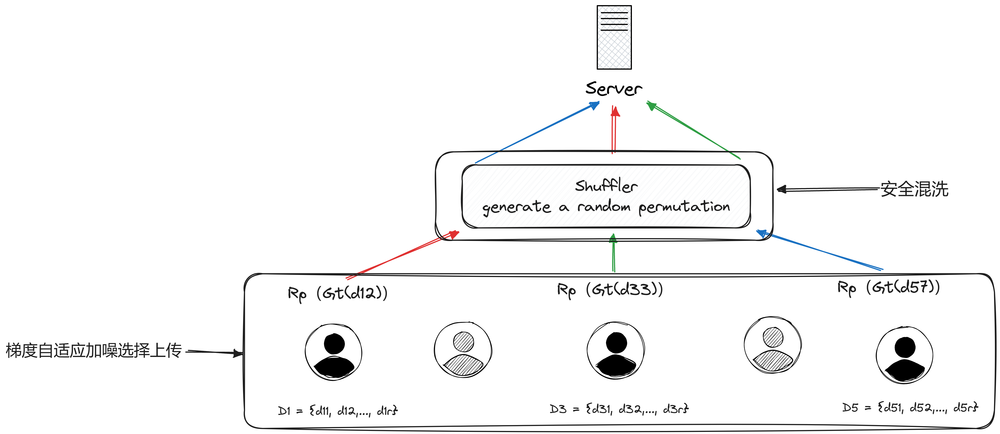
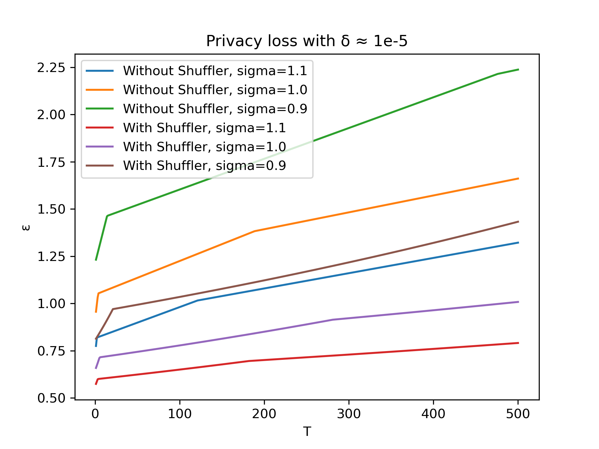

# Differential Privacy and Shuffler in Federated Learning System

This project as my graduate project, aims to enhance the privacy protection capabilities of federated learning systems by integrating Differential Privacy and the Shuffler mechanism. It's designed for distributed machine learning scenarios with stringent privacy requirements.

## Motivation and Background

In the era of ubiquitous data, protecting individual privacy has become a significant challenge. Although federated learning offers a way to conduct machine learning tasks without sharing raw data among participants, it still faces potential privacy leakage risks. This project introduces Differential Privacy and the Shuffler mechanism to federated learning to minimize these risks and enhance the system's overall privacy protection.

## Folder Directory Structure

The folder directory structure of LobeChat is as follows:

```bash
.
├── algorithms
│   ├── DPSGD.py
│   └── train_with_DPSGD.py
├── data
│   ├── cifar-10-batches-py
│   ├── FashionMNIST
│   ├── MNIST
│   └── utils
│       ├── custom_tensor_dataset.py
│       ├── dirichlet_nonIID_data.py
│       ├── get_data.py
│       └── sampling.py
├── FL
│   ├── fed_avg
│   │   ├── fed_avg.py
│   │   ├── fed_avg_with_dp_auto.py
│   │   ├── fed_avg_with_dp_perlayer.py
│   │   ├── fed_avg_with_dp.py
│   │   └── fed_avg_with_dp_with_shuffler.py
│   └── utils
│       ├── create_client.py
│       ├── local_train.py
│       ├── log_helper.py
│       ├── train_helper.py
│       └── update_model.py
├── imgs
│   └── architecture.png
├── log
├── models
│   ├── CIFAR10.py
│   ├── FMNIST.py
│   ├── get_model.py
│   └── MNIST.py
├── privacy_analysis
│   ├── log
│   │   ├── privacy_loss_comparsion.png
│   │   ├── q_for_batch_size_0.01_sigma_1.0_delta_1e-5_algorithm_fed_avg_with_dp.csv
│   │   ├── q_for_batch_size_0.01_sigma_1.0_delta_1e-5_algorithm_fed_avg_with_dp_with_shuffler.csv
│   │   └── q_for_batch_size_0.01_sigma_1.1_delta_1e-5_algorithm_fed_avg_with_dp.csv
│   ├── compute_dp_sgd.py
│   ├── compute_rdp.py
│   ├── get_MaxSigma_or_MaxSteps.py
│   ├── plot.py
│   ├── rdp_convert_dp.py
│   ├── shuffle.py
│   └── simulation_privacy_loss.py
├── saved_states
│   ├── dataset_FMNIST_lr_0.001_clients_10_q_0.01_max_norm_0.1_sigma_1.0_delta_1e-05
│   ├── dataset_MNIST_lr_0.002_clients_10_q_0.01_max_norm_0.1_sigma_1.0_delta_1e-05
│   ├── dataset_MNIST_lr_0.002_clients_10_q_0.01_max_norm_0.1_sigma_1.1_delta_1e-05
│   └── dataset_MNIST_lr_0.002_clients_10_q_0.01_max_norm_1.0_sigma_1.0_delta_1e-05
├── train_and_validation
│   ├── train.py
│   ├── train_with_dp.py
│   └── validation.py
├── utils
│   └── dp_optimizer.py
├── config.yml
├── environment.yml
├── LICENSE
├── main.py
└── README.md
```

## Installation Guide

This project requires Python 3.9 or higher. Follow these steps to install the necessary dependencies:

```bash
git clone https://github.com/jjllzhang/DPFL4GraduateProject.git
cd DPFL4GraduateProject
conda env create -f environment.yml
conda activate DPFL
```

## Usage Example

Here's a simple example of how to start a federated learning task with differential privacy and Shuffler mechanism enabled:

- First check the parameters in [`config.yml`](./config.yml)
- Modify the parameters as you want
- Then run the following bash to start training the model

```bash
python main.py
```

## Technical Architecture and Key Technologies

### Architecture overview



### Differential Privacy

implement the following:

- Perlayer DP
- Auto DP
- DP with Shuffler

Differential Privacy (DP) ensures that the removal or addition of a single database item does not significantly affect the outcome of any analysis, providing strong privacy guarantees for individuals' data.

### Shuffler Mechanism

The Shuffler mechanism adds an additional layer of privacy by randomly permuting data points. This process helps in breaking the link between the data and its source, further enhancing privacy.

### Federated Learning

The core of our project, Federated Learning, is a distributed machine learning approach that enables multiple participants to collaboratively learn a shared model while keeping their data local.

## Features

- **Privacy-Preserving**: Implements 3 kinds of Differential Privacy Federated Learning and Shuffler mechanisms.
- **Scalability**: Designed to efficiently handle large-scale federated learning tasks.
- **Flexibility**: Supports various federated learning scenarios and configurations.
- **Privacy-Accountant**: Uses Renyi Differential Privacy to account for the privacy loss to get tighter bounds

## Performance Metrics and Advantages

The system has been rigorously tested under different conditions, demonstrating significant improvements in privacy protection without compromising learning efficiency.

### Test Accurary Comparision

TODO: show acc comparisions

### Privacy Loss Comparision



## Copyright and License

This project is licensed under the Apache License - see the [`LICENSE`](./LICENSE) file for details.

## Acknowledgments

- A special thanks to [@JeffffffFu](https://github.com/JeffffffFu) whose DP videos uploaded at [Bilibili](https://bilibili.com) and codes implemention help me lot.
- Gratitude to my lab who provides me a server for experimental test.
- Appreciation for the open-source community for the tools and libraries that made this project possible.
